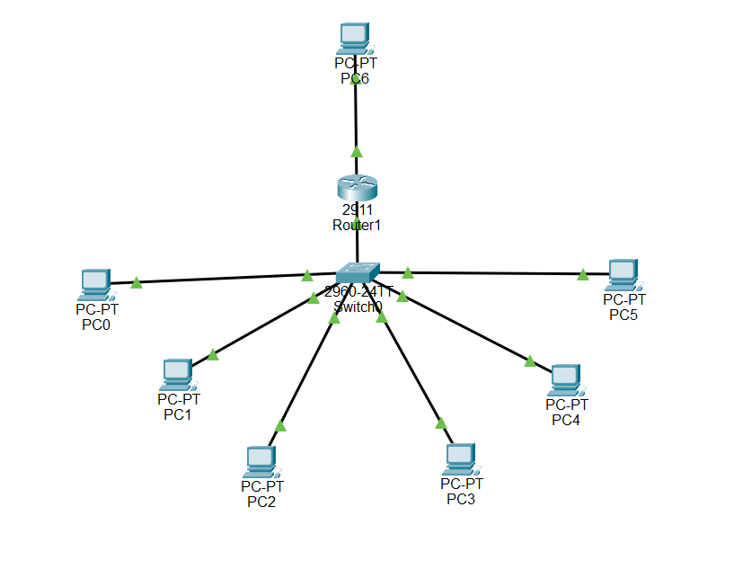
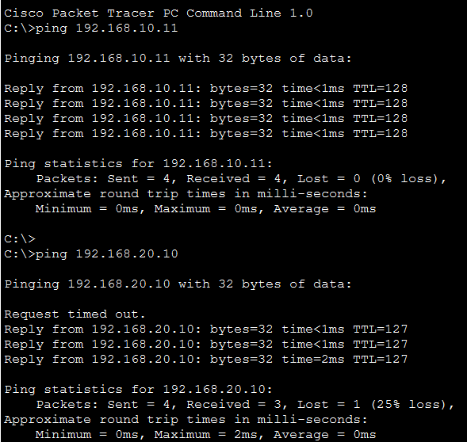
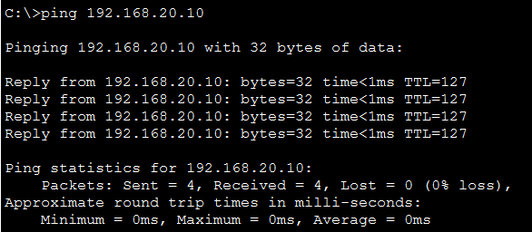
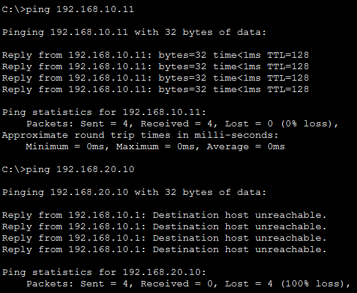
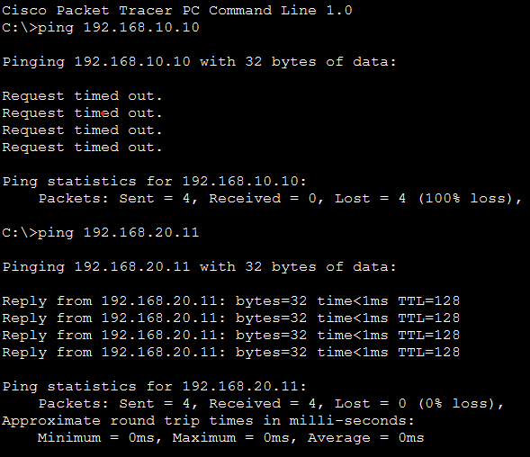

# Packet Tracer: Implementación de VLANs y Segmentación Lógica de Red

<div align="justify">

Documentación detallada sobre el diseño, enrutamiento inter-VLAN y políticas de control de acceso de una infraestructura de red local segmentada utilizando la herramienta de simulación Cisco Packet Tracer.

</div>

---


## 🏗️ Topología de la Red y Conexión Física

<div align="justify">

El diseño implementa una <b>Topología en Estrella</b> centrada en un switch como núcleo del sistema. Todos los equipos finales están conectados de manera directa o indirecta a este de forma física mediante cable de cobre directo estándar Ethernet, asegurando la resiliencia de la red: si un host o un cable falla, los demás segmentos lógicos crean un entorno aislado y continúan operando normalmente.

</div>

<div align="justify">

Para interconectar los dispositivos se utilizó cable de cobre directo, siguiendo el estándar Ethernet, ya que es el medio adecuado para conectar equipos que operan en distintas capas del modelo OSI. Una mala planificación física puede inducir fallos de conectividad complejos de diagnosticar, haciendo perder tiempo al administrador de sistemas.

</div>


### Mapeo de Conexiones Físicas
* **Router G0/0** ➔ Switch Fa0/24
* **Router G0/1** ➔ PC6 (Subred independiente)
* **PC0 a PC5** ➔ Switch Fa0/1 a Fa0/6


### 🖼️ Esquema Visual de la Topología en el Simulador
 

---


## 📊 Segmentación Lógica (VLANs) y Direccionamiento

<div align="justify">

Una VLAN permite dividir un switch físico en múltiples redes lógicas independientes. Los dispositivos conectados al mismo switch se comportan como si estuvieran en redes separadas físicamente. Al configurarse en modo <b>Access</b>, el switch asigna automáticamente el tráfico a una VLAN concreta mediante una tabla interna de identificadores, haciendo que el proceso sea transparente para el dispositivo final (el PC no es consciente de la existencia de la VLAN).

</div>

<div align="justify">

Al aislar los dominios de broadcast de cada departamento, los dispositivos de una VLAN no pueden visualizar el tráfico de otra, lo que optimiza el ancho de banda de la red local y mitiga de raíz ataques de <i>sniffing</i> o interceptación de paquetes.

</div>


### Tabla de Direccionamiento IP Estático

| Departamento / Red | ID de VLAN | Puertos de Switch | Dirección IP Estática | Máscara de Red | Gateway (Router) |
| :--- | :---: | :---: | :--- | :---: | :--- |
| **ADMIN** | 10 | Fa0/1 - Fa0/3 | `192.168.10.10` a `.12` | `255.255.255.0` | `192.168.10.1` |
| **VENTAS** | 20 | Fa0/4 - Fa0/6 | `192.168.20.10` a `.12` | `255.255.255.0` | `192.168.20.1` |
| **Subred PC6** | N/A *(Física)* | Conexión directa G0/1 | `192.168.30.10` | `255.255.255.0` | `192.168.30.1` |

---


## 🛠️ Configuración de Equipos e Interconexión (Cisco IOS)


### 1. Creación de VLANs en el Switch

```bash
Switch# configure terminal
Switch(config)# vlan 10
Switch(config-vlan)# name ADMIN
Switch(config-vlan)# exit
Switch(config)# vlan 20
Switch(config-vlan)# name VENTAS
```


### 2. Asignación de Puertos de Acceso (Access)

```bash
Switch(config)# interface range fa0/1-3
Switch(config-if-range)# switchport mode access
Switch(config-if-range)# switchport access vlan 10
Switch(config-if-range)# exit

Switch(config)# interface range fa0/4-6
Switch(config-if-range)# switchport mode access
Switch(config-if-range)# switchport access vlan 20
```


### 3. Configuración del Enlace Troncal (Trunk)

<div align="justify">

El puerto <b>Fa0/24</b> se configuró en modo troncal. A diferencia del modo access, un enlace trunk permite transportar múltiples VLANs a través de un solo enlace físico utilizando el protocolo <b>IEEE 802.1Q</b>. Dado que un equipo final no entiende las etiquetas, el switch remueve la etiqueta al entregar el paquete al PC; sin embargo, el router sí comprende el protocolo y necesita el etiquetado para diferenciar el tráfico que viaja por el único cable físico disponible.

</div>

```bash
Switch(config)# interface fa0/24
Switch(config-if)# switchport mode trunk
```


### 4. Arquitectura Router-on-a-Stick

<div align="justify">

Dado que los routers físicos cuentan con interfaces limitadas, se virtualizó la interfaz principal dividiéndola en subinterfaces lógicas independientes para que actúen como puertas de enlace y puntos centrales de enrutamiento:

</div>

```bash
Router(config)# interface gigabitethernet0/0
Router(config-if)# no shutdown

Router(config)# interface gigabitethernet0/0.10
Router(config-subif)# encapsulation dot1Q 10
Router(config-subif)# ip address 192.168.10.1 255.255.255.0

Router(config)# interface gigabitethernet0/0.20
Router(config-subif)# encapsulation dot1Q 20
Router(config-subif)# ip address 192.168.20.1 255.255.255.0
```

---


## 🔐 Control de Tráfico mediante ACL (Firewall Estático)

<div align="justify">

Al implementar el enrutamiento inter-VLAN, las redes lógicas dejan de estar aisladas automáticamente. Para recuperar el control de la seguridad, se aplicó una <b>Lista de Control de Acceso Extendida (access-list 100)</b> en la subinterfaz del router para implementar el <b>Principio de Mínimo Privilegio</b> (un usuario solo debe acceder a lo estrictamente necesario). Esto bloquea el movimiento lateral y reduce el impacto si un host es comprometido por un atacante.

</div>

```bash
Router(config)# access-list 100 deny ip 192.168.10.0 0.0.0.255 192.168.20.0 0.0.0.255
Router(config)# access-list 100 permit ip any any
Router(config)# interface gigabitethernet0/0.10
Router(config-subif)# ip access-group 100 in
```

<div align="justify">

<b>Uso del rango de numeración:</b> Se implementó una ACL extendida (rango 100-199) porque las ACL estándar (rango 1-99) solo pueden verificar la dirección IP de origen (saben quién envía pero no a dónde va). Para este laboratorio era obligatorio conocer el origen y el destino exactos para validar que cada VLAN se comunique únicamente consigo misma, permitiendo mantener las ACL estándar libres para tareas como bloquear la salida general a Internet.

</div>

---


## 🧪 Red Aislada del PC6 y Pruebas de Conectividad

<div align="justify">

Para validar la flexibilidad de la topología, se levantó una subred independiente en la interfaz física <code>G0/1</code> del router para dar servicio al equipo <b>PC6</b> (`192.168.30.10`). Al estar mapeada fuera de la lógica de las VLANs, mantiene conectividad bidireccional completa con ambos departamentos.

</div>

```bash
Router(config)# interface g0/1
Router(config-if)# ip address 192.168.30.1 255.255.255.0
Router(config-if)# no shutdown
```


### Resultados del Diagnóstico de Red (Ping)

<div align="justify">

Las políticas de red se validaron mediante trazas ICMP en la consola, obteniendo dos códigos de error clave según el estado de la ACL:

</div>

* **Comportamiento sin ACL:** Comunicación inter-VLAN libre y exitosa entre todos los extremos de la red.
* **Comportamiento con ACL activa:** Los pings cruzados ADMIN ➔ VENTAS fallaron correctamente, arrojando dos diagnósticos:
  * `Request timed out`: Representa una pérdida total del paquete sin respuesta del destino.
  * `Destination host unreachable`: El router intercepta y bloquea activamente el paquete aplicando la política de seguridad.


### 🖼️ Capturas Reales de las Pruebas de Conectividad (Consola)


**Sin ACL**

VLAN 10:

 

VLAN 20:

 


**Con ACL***

VLAN 10:

 

VLAN 20:

 

---


## 🧠 ¿Qué aprendí realizando este laboratorio?

<div align="justify">

* <b>Escalabilidad y automatización:</b> El direccionamiento estático manual ofrece un control total en entornos pequeños de laboratorio, pero carece de escalabilidad en infraestructuras empresariales reales. Para evitar errores humanos de configuración, es fundamental delegar estas tareas a servidores <b>DHCP</b>.
* <b>Segmentación de seguridad:</b> La separación lógica mediante VLANs es una de las defensas de arquitectura de red más eficientes y vigentes, permitiendo delimitar perímetros virtuales robustos y regular de forma milimétrica qué datos se transmiten entre los recursos de una organización.

</div>

